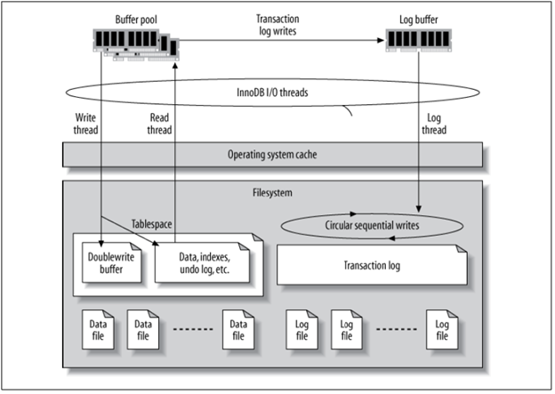
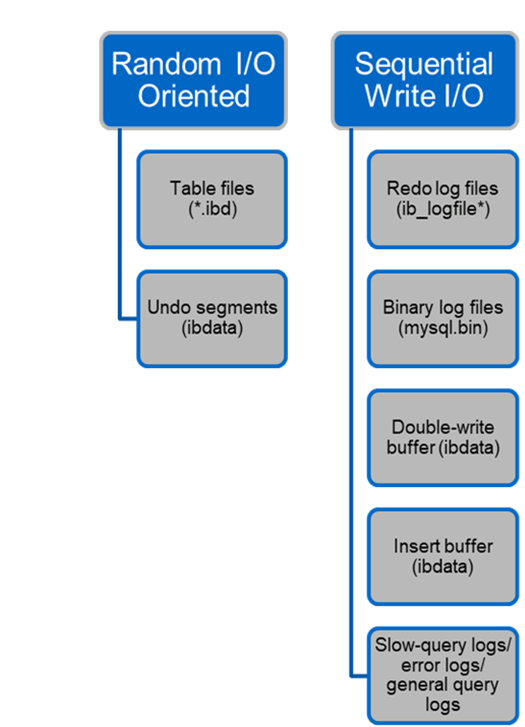

= 文件结构
:allow-uri-read: 
:icons: font
:imagesdir: ../media/

[role="lead"]
InnoDB充当存储和MySQL服务器之间的中间层、它将数据存储到驱动器。

MySQL I/O分为两类：

* 随机文件I/O
* 顺序文件I/O

数据文件会随机读取和覆盖、从而导致IOPS较高。因此、建议使用SSD存储。

重做日志文件和二进制日志文件是事务日志。它们会按顺序写入、因此、您可以通过写入缓存在HDD上获得良好的性能。恢复时会发生顺序读取、但很少会导致性能问题、因为日志文件大小通常小于数据文件、顺序读取比随机读取(发生在数据文件上)速度快。

双写缓冲区是InnoDB的一项特殊功能。InnoDB首先将已刷新的页面写入双写入缓冲区、然后将这些页面写入数据文件上的正确位置。此过程可防止页面损坏。如果没有双写入缓冲区、则在向驱动器写入的过程中发生电源故障时、页面可能会损坏。由于写入双写入缓冲区是顺序的、因此针对HDD进行了高度优化。恢复时进行顺序读取。

由于ONTAP NVRAM已提供写入保护、因此不需要双写缓冲。MySQL有一个参数、 `skip_innodb_doublewrite`，禁用双写缓冲区。此功能可以显著提高性能。

插入缓冲区也是InnoDB的一项特殊功能。如果内存中不存在非唯一的二级索引块、则InnoDB会将条目插入到插入缓冲区中、以避免随机I/O操作。插入缓冲区会定期合并到数据库中的二级索引树中。插入缓冲区通过将I/O请求合并到同一个块来减少I/O操作的数量；随机I/O操作可以是顺序的。插入缓冲区也针对HDD进行了高度优化。正常操作期间会同时进行顺序写入和读取。

撤消段是随机I/O导向的。为了保证多版本并发(MVCC)，InnoDB必须在撤消段中注册旧图像。从撤消段读取以前的图像需要随机读取。如果您运行具有可重复读取的长事务(例如、myq_dump—单个事务)或运行长查询、则可能会发生随机读取。因此、在这种情况下、最好在SSD上存储撤消区块。如果只运行短事务或查询、则随机读取不是问题描述。

[TIP]
====
*由于InnoDB I/O的特性、NetApp建议*采用以下存储设计布局。

* 一个卷、用于存储面向MySQL的随机和顺序I/O文件
* 另一个卷、用于存储MySQL的纯顺序I/O导向文件

此布局还有助于您设计数据保护策略和策略。

====