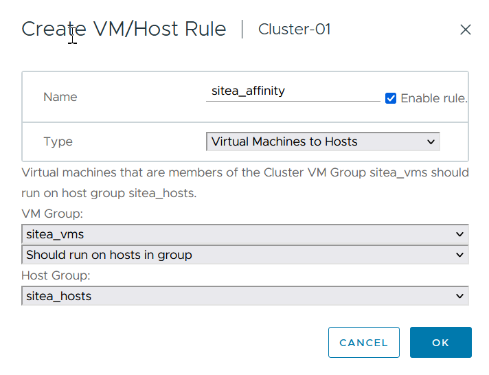

= 《VMSC设计和实施准则》
:hardbreaks:
:allow-uri-read: 
:nofooter: 
:icons: font
:linkattrs: 
:imagesdir: ../media/

[role="lead"]
本文档概述了使用ONTAP存储系统的VMSC的设计和实施指南。

== NetApp存储配置

有关NetApp MetroCluster (称为MCC配置)的设置说明，请访问 https://docs.netapp.com/us-en/ontap-metrocluster/["MetroCluster 文档"]。有关SnapMirror活动同步(SMA)的说明，请参见 https://docs.netapp.com/us-en/ontap/smbc/index.html["SnapMirror 业务连续性概述"]。

配置MetroCluster后、对其进行管理就像管理传统ONTAP环境一样。您可以使用命令行界面(CLI)、System Manager或Ans得 等各种工具设置Storage Virtual Machine (SVM)。配置SVM后、在集群上创建要用于正常操作的逻辑接口(Logical Interface、Li)、卷和逻辑单元号(Logical Unit Number、LUN)。这些对象将自动通过集群对等网络复制到另一个集群。

如果不使用MetroCluster、则可以使用SnapMirror主动同步、它可以在不同故障域的多个ONTAP集群之间提供数据存储库粒度保护和主动-主动访问。SMA使用一致性组(一致性组、CGS)确保一个或多个数据存储库之间的写入顺序一致性、您可以根据应用程序和数据存储库要求创建多个CGS。对于需要在多个数据存储库之间同步数据的应用程序、一致性组尤其有用。此外、SMA还支持原始设备映射(Raw Device Mapping、RDM)以及通过子系统内iSCSI启动程序连接到子系统的存储。有关一致性组的详细信息，请访问 https://docs.netapp.com/us-en/ontap/consistency-groups/index.html["一致性组概述"]。

现在、ONTAP工具提供了一种为VMSC配置SnapMirror活动同步的简单方法。您可以使用ONTAP工具vCenter插件在两个ONTAP集群之间创建和管理SnapMirror活动同步关系。此插件提供了一个简单直观的界面、用于在两个ONTAP集群之间创建和管理SnapMirror活动同步关系。有关ONTAP工具vCenter插件的详细信息，请访问 https://docs.netapp.com/us-en/ontap-tools-vmware-vsphere-10/index.html["适用于 VMware vSphere 的 ONTAP 工具"]，或者直接跳转到 https://docs.netapp.com/us-en/ontap-tools-vmware-vsphere-10/configure/protect-cluster.html["使用主机集群保护进行保护"]。

与MetroCluster相比、使用SnapMirror活动同步管理VMSC配置有一些不同。首先、SMA是一种仅SAN配置、SnapMirror活动同步无法保护任何NFS数据存储库。其次、您必须将两个LUN副本映射到ESXi主机、以使其能够访问这两个故障域中复制的数据存储库。

== VMware vSphere配置

=== 创建vSphere HA集群

创建vSphere HA集群是一个多步骤过程、有关详细信息、请参见 https://docs.vmware.com/en/VMware-vSphere/8.0/vsphere-vcenter-esxi-management/GUID-F7818000-26E3-4E2A-93D2-FCDCE7114508.html["如何在docs.vmware.com上的vSphere Client中创建和配置集群"]。简而言之、您必须先创建一个空集群、然后使用vCenter添加主机并指定集群的vSphere HA和其他设置。

NOTE: 本文档中的任何内容均不会取代 https://www.vmware.com/docs/vmw-vmware-vsphere-metro-storage-cluster-recommended-practices["VMware vSphere Metro Storage Cluster 建议的实践"]。本内容仅供参考、不能替代VMware官方文档。

要配置HA集群、请完成以下步骤：

. 连接到vCenter UI。
. 在主机和集群中、浏览到要创建HA集群的数据中心。
. 右键单击数据中心对象、然后选择"New Cluster"(新建集群)。在基础下、确保已启用vSphere DRS和vSphere HA。完成向导。

image::../media/vmsc_3_1.png[新建集群,624,302]

. 选择集群并转到配置选项卡。选择vSphere HA、然后单击编辑。
. 在"Host Monitoring"(主机监控)下、选择"Enable Host Monitoring"(启用主机监控)选项。

image::../media/vmsc_3_2.png[启用主机监控选项,624,475]

. 仍在故障和响应选项卡上的VM监控下、选择仅VM监控选项或VM和应用程序监控选项。

image::../media/vmsc_3_3.png[VM监控,624,480]

. 在"Admission Control"(准入控制)下、将HA准入控制选项设置为"Cluster Resource resource"(集群资源预留)；使用50% CPU/MEM。

image::../media/vmsc_3_4.png[准入控制,624,479]

. 单击"OK"(确定)。
. 选择DRS并单击编辑。
. 除非您的应用程序要求、否则请将自动化级别设置为手动。

image::../media/vmsc_3_5.png[VMSC 3 5.,624,336]

. 启用VM组件保护、请参见 https://docs.vmware.com/en/VMware-vSphere/8.0/vsphere-availability/GUID-F01F7EB8-FF9D-45E2-A093-5F56A788D027.html["docs.vmware.com"]。
. 对于采用MCC的VMSC、建议使用以下附加vSphere HA设置：

[cols="50%,50%"]
|===
| 失败 | 响应 

| 主机故障 | 重新启动VM 

| 主机隔离 | 已禁用 

| 具有永久设备丢失(永久设备丢失)的数据存储库 | 关闭并重新启动VM 

| 所有路径均已关闭的数据存储库(APD) | 关闭并重新启动VM 

| 子系统不检测信号 | 重置虚拟机 

| VM重新启动策略 | 由虚拟机的重要性决定 

| 主机隔离响应 | 关闭并重新启动VM 

| 对使用了基于数据存储库的数据存储库的响应 | 关闭并重新启动VM 

| 使用APD响应数据存储库 | 关闭并重新启动VM (保守) 

| APD的VM故障转移延迟 | 3分钟 

| 响应APD恢复并显示APD超时 | 已禁用 

| VM监控敏感度 | 预设为高 
|===

=== 配置用于检测信号的存储库

当管理网络出现故障时、vSphere HA使用数据存储库监控主机和虚拟机。您可以配置vCenter选择检测信号数据存储库的方式。要为数据存储库配置检测信号、请完成以下步骤：

. 在数据存储库检测信号部分中、选择使用指定列表中的数据存储库并根据需要自动完成。
. 从两个站点中选择要vCenter使用的数据存储库、然后按OK。

image::../media/vmsc_3_6.png[自动生成的计算机问题描述的屏幕截图,624,540]

=== 配置高级选项

如果HA集群中的主机与网络或集群中的其他主机断开连接、则会发生隔离事件。默认情况下、vSphere HA将使用其管理网络的默认网关作为默认隔离地址。但是、您可以为要执行ping操作的主机指定其他隔离地址、以确定是否应触发隔离响应。添加两个可执行ping操作的隔离IP、每个站点一个。请勿使用网关IP。使用的vSphere HA高级设置为"as.isolationaddress"。为此、您可以使用ONTAP或调解器IP地址。

请参见 https://core.vmware.com/resource/vmware-vsphere-metro-storage-cluster-recommended-practices#sec2-sub5["core.vmware.com"] 有关详细信息__.__

image::../media/vmsc_3_7.png[自动生成的计算机问题描述的屏幕截图,624,545]

添加名为ds.heartbeatDsPerHost的高级设置可以增加检测信号数据存储库的数量。使用四个检测信号数据存储库(HB DSS)—每个站点两个。使用“从列表中选择但恭维”选项。这是必需的、因为如果一个站点发生故障、您仍需要两个HB DSS。但是、这些数据不必通过MCC或SnapMirror主动同步进行保护。

请参见 https://core.vmware.com/resource/vmware-vsphere-metro-storage-cluster-recommended-practices#sec2-sub5["core.vmware.com"] 有关详细信息__.__

适用于NetApp MetroCluster的VMware DRS关联

在本节中、我们将为MetroCluster环境中每个站点\集群的VM和主机创建DRS组。然后、我们配置VM\Host规则、使VM主机与本地存储资源的关联性保持一致。例如、站点A的VM属于VM组sitea_vm、站点A的主机属于主机组sitea_hosts。接下来、在VM\Host规则中、我们说明site_vm应在sitea_hosts中的主机上运行。

[TIP]
====
* NetApp强烈建议使用规范“*应在组中的主机上运行”，而不是规范“必须在组中的主机上运行”。如果站点A主机发生故障、则需要通过vSphere HA在站点B的主机上重新启动站点A的VM、但后一种规范不允许HA重新启动站点B上的VM、因为这是一条硬规则。前一种规范是一种软规则、在发生HA时会违反该规范、从而实现可用性而非性能。
* 您可以创建基于事件的警报、当虚拟机违反VM-主机关联性规则时触发该警报。在vSphere Client中、为虚拟机添加新警报、然后选择"VM is violating VM-Host Affinity Rule "作为事件触发器。有关创建和编辑警报的详细信息、请参阅link:https://techdocs.broadcom.com/us/en/vmware-cis/vsphere/vsphere/8-0/vsphere-monitoring-and-performance-8-0.html["vSphere监控和性能"^]文档。

====

=== 创建DRS主机组

要创建特定于站点A和站点B的DRS主机组、请完成以下步骤：

. 在vSphere Web Client中、右键单击清单中的集群、然后选择设置。
. 单击VM\Host Groups。
. 单击添加。
. 键入组的名称(例如、sitea_hosts)。
. 从类型菜单中、选择主机组。
. 单击Add、然后从站点A中选择所需主机、然后单击OK。
. 重复上述步骤、为站点B添加另一个主机组
. 单击确定。

=== 创建DRS VM组

要创建特定于站点A和站点B的DRS VM组、请完成以下步骤：

. 在vSphere Web Client中、右键单击清单中的集群、然后选择设置。

. 单击VM\Host Groups。
. 单击添加。
. 键入组的名称(例如、sitea_VMs.)。
. 从Type菜单中、选择VM Group。
. 单击添加并从站点A选择所需的VM、然后单击确定。
. 重复上述步骤、为站点B添加另一个主机组
. 单击确定。

=== 创建VM主机规则

要创建特定于站点A和站点B的DRS相关性规则、请完成以下步骤：

. 在vSphere Web Client中、右键单击清单中的集群、然后选择设置。

. 单击VM\Host Rule。
. 单击添加。
. 键入规则的名称(例如、sitea_affinity)。
. 验证是否已选中"Enable Rule (启用规则)"选项。
. 从类型菜单中、选择虚拟机到主机。
. 选择VM组(例如、sitea_vm)。
. 选择主机组(例如、sitea_hosts)。
. 重复上述步骤、为站点B添加另一个VM\Host规则
. 单击确定。

== 根据需要创建数据存储库集群

要为每个站点配置数据存储库集群、请完成以下步骤：

. 使用vSphere Web Client、浏览到"Storage"(存储)下HA集群所在的数据中心。
. 右键单击数据中心对象、然后选择"Storage"(存储)>"New Datastore Cluster"(新建数据存储库集群)。

[TIP]
====
*使用ONTAP存储时、建议禁用存储DRS。

* 通常、不需要或不建议将存储DRS用于ONTAP存储系统。
* ONTAP提供自己的存储效率功能、例如重复数据删除、数据压缩和数据缩减、这些功能可能会受到存储DRS的影响。
* 如果您使用的是ONTAP快照、则Storage vMotion会在快照中保留VM副本、这可能会提高存储利用率、并可能影响NetApp SnapCenter等跟踪VM及其ONTAP快照的备份应用程序。

====
image::../media/vmsc_3_9.png[存储 DRS,528,94]

. 选择HA集群、然后单击"Next"(下一步)。

image::../media/vmsc_3_11.png[HA集群,624,149]

. 选择属于站点A的数据存储库、然后单击下一步。

image::../media/vmsc_3_12.png[数据存储库,624,134]

. 查看选项、然后单击完成。
. 重复上述步骤以创建站点B数据存储库集群、并验证是否仅选择了站点B的数据存储库。

=== vCenter Server可用性

您的vCenter Server设备(VCSA)应通过vCenter HA进行保护。通过vCenter HA、您可以在一个主动-被动HA对中部署两个VCSA。每个故障域一个。您可以在上阅读有关vCenter HA的更多信息 https://docs.vmware.com/en/VMware-vSphere/8.0/vsphere-availability/GUID-4A626993-A829-495C-9659-F64BA8B560BD.html["docs.vmware.com"]。
