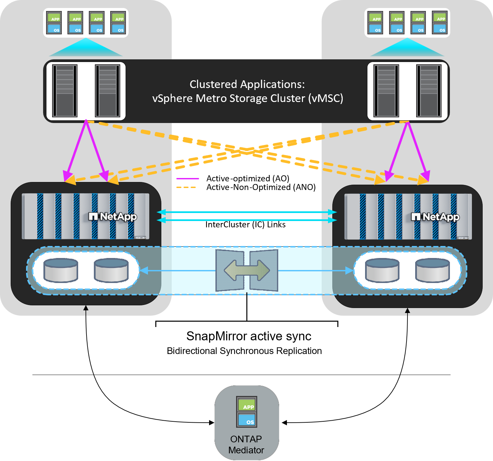

= 采用ONTAP的vSphere Metro存储集群
:hardbreaks:
:allow-uri-read: 
:nofooter: 
:icons: font
:linkattrs: 
:imagesdir: ../media/

[role="lead"]
VMware行业领先的vSphere虚拟机管理程序可部署为延伸型集群、称为vSphere Metro Storage Cluster (VMSC)。

NetApp®MetroCluster™和SnapMirror主动同步(以前称为SnapMirror业务连续性或SMBC)均支持VMSC解决方案，如果一个或多个故障域发生完全中断，则可以提供高级业务连续性。不同故障模式的故障恢复能力取决于您选择的配置选项。

NOTE: 本文档可替代先前发布的技术报告_TR-4128：《基于NetApp MetroCluster的vSphere》_

== 适用于vSphere环境的持续可用性解决方案

ONTAP架构是一个灵活且可扩展的存储平台、可为数据存储库提供SAN (FCP、iSCSI和NVMe-oF)和NAS (NFS v3和v4.1)服务。NetApp AFF、ASA和FAS存储系统使用ONTAP操作系统为子系统存储访问提供其他协议、例如S3和SMB/CCIFS。

NetApp MetroCluster使用NetApp的HA (控制器故障转移或CFO)功能来防止控制器发生故障。它还包括本地SyncMirror技术、灾难时集群故障转移(集群灾难故障转移或CFOD)、硬件冗余和地理分隔、以实现高可用性。SyncMirror通过将数据写入两个丛(本地磁盘架上主动提供数据的本地丛和通常不提供数据的远程丛)、在MetroCluster配置的两部分之间同步镜像数据。所有MetroCluster组件(例如控制器、存储、缆线、交换机(用于光纤MetroCluster)和适配器)都具有硬件冗余。

非MetroCluster系统和ASA R2系统上提供的NetApp SnapMirror主动同步功能可通过FCP和iSCSI SAN协议提供数据存储库粒度保护。通过它、您可以保护整个VMSC、也可以有选择地保护高优先级工作负载。与主动-备用解决方案NetApp MetroCluster不同、它可以同时对本地和远程站点进行主动-主动访问。从ONTAP 9.15.1开始、SnapMirror主动同步支持对称主动/主动功能、可通过双向同步复制从受保护LUN的两个副本执行读写I/O操作、从而使两个LUN副本均可在本地处理I/O操作。在ONTAP 9.151之前的版本中、SnapMirror主动同步仅支持非对称主动/主动配置、即二级站点上的数据代理到LUN的主副本。

要在两个站点之间创建VMware HA/DRS集群、需要使用vCenter Server Appliance (VCA)来管理ESXi主机。vSphere管理、vMotion®和虚拟机网络通过两个站点之间的冗余网络进行连接。管理HA/DRS集群的vCenter Server可以连接到两个站点上的ESXi主机、并且应使用vCenter HA进行配置。

请参见 https://docs.vmware.com/en/VMware-vSphere/8.0/vsphere-vcenter-esxi-management/GUID-F7818000-26E3-4E2A-93D2-FCDCE7114508.html["如何在vSphere Client中创建和配置集群"] 配置vCenter HA。

您还应参考 https://www.vmware.com/docs/vmw-vmware-vsphere-metro-storage-cluster-recommended-practices["VMware vSphere Metro Storage Cluster 建议的实践"]。

== 什么是vSphere Metro Storage Cluster？

vSphere Metro Storage Cluster (VMSC)是一种经过认证的配置、可保护虚拟机(VM)和容器免受故障的影响。这可以通过使用延伸型存储概念以及分布在不同故障域(例如机架、建筑物、园区甚至城市)中的ESXi主机集群来实现。NetApp MetroCluster和SnapMirror主动同步存储技术用于为主机集群提供零恢复点目标(RPO = 0)保护。VMSC配置旨在确保数据始终可用、即使完整的物理或逻辑"站点"发生故障也是如此。在成功完成VMSC认证过程后、属于VMSC配置的存储设备必须经过认证。所有受支持的存储设备均可在中找到 https://www.vmware.com/resources/compatibility/search.php["《VMware存储兼容性指南》"]。

如果您需要有关vSphere Metro Storage Cluster设计准则的详细信息、请参阅以下文档：

* https://kb.vmware.com/s/article/2031038["NetApp MetroCluster支持VMware vSphere"]
* https://kb.vmware.com/s/article/83370["VMware vSphere支持NetApp SnapMirror业务连续性"] (现在称为SnapMirror活动同步)

NetApp MetroCluster可以部署在两种不同的配置中、以便与vSphere结合使用：

* 延伸型MetroCluster
* 光纤MetroCluster

下图展示了延伸型MetroCluster的高层面拓扑图。

image::../media/vmsc_mcc_overview.png[使用MetroCluster的VMSC示意图]

请参见 https://www.netapp.com/support-and-training/documentation/metrocluster/["MetroCluster 文档"] 了解MetroCluster的特定设计和部署信息。

SnapMirror主动同步也可以通过两种不同的方式进行部署。

* 非对称
* 对称活动同步(ONTAP 9.15.1)

有关SnapMirror主动同步的特定设计和部署信息、请参见 https://docs.netapp.com/us-en/ontap/smbc/index.html["NetApp文档"]。
