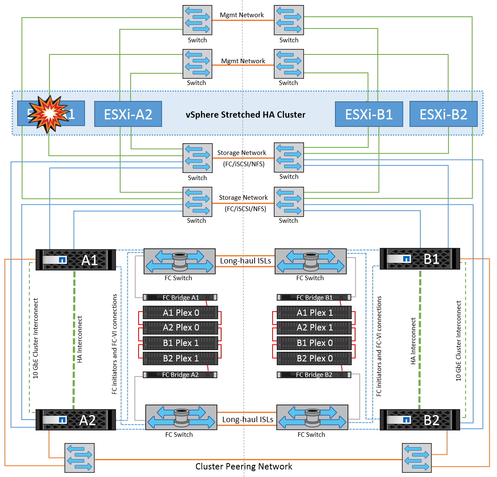
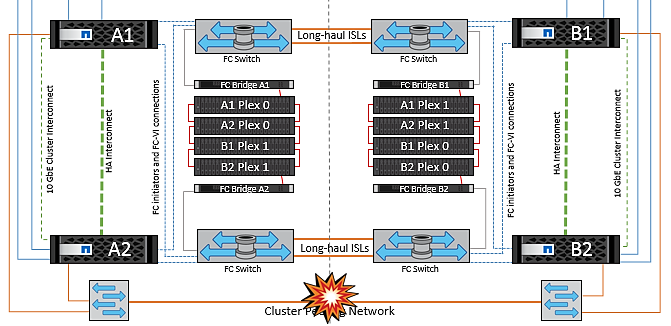

= 使用MCC的VMSC的故障情形
:hardbreaks:
:allow-uri-read: 
:nofooter: 
:icons: font
:linkattrs: 
:imagesdir: ../media/

[role="lead"]
以下各节概述了VMSC和NetApp MetroCluster系统的各种故障情形的预期结果。

== 单个存储路径故障

在这种情况下、如果组件(例如HBA端口、网络端口、前端数据交换机端口或FC或以太网缆线)发生故障、ESXi主机会将存储设备的特定路径标记为无活动。如果通过在HB/网络/交换机端口提供故障恢复能力来为存储设备配置多个路径、则ESXi最好执行路径切换。在此期间、虚拟机将保持运行状态、而不会受到影响、因为通过提供存储设备的多个路径、可以确保存储可用性。

NOTE: 在这种情况下、MetroCluster的行为没有变化、所有数据存储库在其各自的站点中仍保持完好。

=== _最佳实践_

在使用NFS/iSCSI卷的环境中、NetApp建议为标准vSwitch中的NFS vmkernel端口至少配置两个网络上行链路、并且在为分布式vSwitch映射NFS vmkernel接口的端口组上配置相同的网络上行链路。NIC绑定可以配置为主动-主动或主动-备用。

此外、对于iSCSI LUN、必须通过将vmkernel接口绑定到iSCSI网络适配器来配置多路径。有关详细信息、请参阅vSphere存储文档。

=== _最佳实践_

在使用光纤通道LUN的环境中、NetApp建议至少配置两个HBA、以确保HHBA/Port级别的故障恢复能力。NetApp还建议配置分区的最佳做法是、为单个目标分区配置单个启动程序。

应使用虚拟存储控制台(VSC)设置多路径策略、因为它会为所有新的和现有的NetApp存储设备设置策略。

== 单个ESXi主机故障

在这种情况下、如果ESXi主机发生故障、VMware HA集群中的主节点会检测到主机故障、因为它不再接收网络检测信号。为了确定主机是否确实已关闭或仅为网络分区、主节点会监控数据存储库检测点、如果没有检测点、它会对故障主机的管理IP地址执行屏显操作来执行最终检查。如果所有这些检查均为否定、则主节点会将此主机声明为故障主机、并且在此故障主机上运行的所有虚拟机都会在集群中的无故障主机上重新启动。

如果已配置DRS VM和主机关联性规则(VM组site_VMs中的VM应运行主机组site_hosts中的主机)、则HA主节点会首先检查站点A上的可用资源如果站点A上没有可用主机、主节点将尝试重新启动站点B主机上的VM

如果本地站点存在资源限制、则虚拟机可能会在另一站点的ESXi主机上启动。但是、如果将虚拟机迁移回本地站点中任何无故障的ESXi主机时违反了任何规则、则定义的DRS VM和主机关联性规则将会进行更正。如果DRS设置为手动、则NetApp建议调用DRS并应用建议以更正虚拟机放置。

在这种情况下、MetroCluster的行为没有变化、所有数据存储库在其各自的站点中仍保持完好。

== ESXi主机隔离

image::../media/vmsc_5_2.png[ESXi主机隔离,624,301]

在这种情况下、如果ESXi主机的管理网络关闭、HA集群中的主节点将不会收到任何检测信号、因此此主机将在网络中隔离。要确定数据存储库是发生故障还是仅被隔离、主节点会开始监控数据存储库检测信号。如果存在、则主节点会声明主机已隔离。根据配置的隔离响应、主机可以选择关闭电源、关闭虚拟机、甚至保持虚拟机处于打开状态。隔离响应的默认间隔为30秒。

在这种情况下、MetroCluster的行为没有变化、所有数据存储库在其各自的站点中仍保持完好。

== 磁盘架故障

在这种情况下、出现两个以上磁盘或整个磁盘架故障。数据从无故障丛提供、而不会中断数据服务。磁盘故障可能会影响本地丛或远程丛。聚合将显示为降级模式、因为只有一个丛处于活动状态。更换故障磁盘后、受影响的聚合将自动重新同步以重建数据。重新同步后、聚合将自动恢复为正常镜像模式。如果一个RAID组中有两个以上的磁盘出现故障、则必须从头开始重建丛。

image::../media/vmsc_5_3.png[单个磁盘架故障。,624,576]

*[注释]

* 在此期间、虚拟机I/O操作不会受到影响、但性能会下降、因为数据是通过ISL链路从远程磁盘架访问的。

== 单个存储控制器故障

在这种情况下、一个站点上的两个存储控制器之一发生故障。由于每个站点都有一个HA对、因此一个节点发生故障会透明地自动触发故障转移到另一个节点。例如、如果节点A1发生故障、其存储和工作负载将自动传输到节点A2。虚拟机不会受到影响、因为所有的plexes都保持可用。第二个站点节点(B1和B2)不受影响。此外、vSphere HA不会执行任何操作、因为集群中的主节点仍将接收网络检测信号。

image::../media/vmsc_5_4.png[单节点故障,624,603]

如果故障转移是滚动灾难的一部分(节点A1故障转移到A2)、则在后续发生A2故障或站点A完全故障时、站点B可能会发生灾难后切换

== 交换机间链路故障

=== 管理网络发生交换机间链路故障

image::../media/vmsc_5_5.png[管理网络发生交换机间链路故障,624,184]

在这种情况下、如果前端主机管理网络的ISL链路发生故障、站点A的ESXi主机将无法与站点B的ESXi主机进行通信这将导致网络分区、因为特定站点上的ESXi主机将无法向HA集群中的主节点发送网络检测点。因此、由于分区、会有两个网段、每个网段中都有一个主节点、用于保护VM免受特定站点中主机故障的影响。

NOTE: 在此期间、虚拟机将保持运行状态、并且MetroCluster行为在此情形下不会发生任何变化。所有数据存储库在其各自的站点中仍保持完好。

=== 存储网络发生交换机间链路故障

image::../media/vmsc_5_6.png[存储网络发生交换机间链路故障,624,481]

在这种情况下、如果后端存储网络上的ISL链路发生故障、站点A的主机将无法访问站点B上集群B的存储卷或LUN、反之亦然。定义了VMware DRS规则、以便主机-存储站点关联性有利于虚拟机在站点内运行而不会受到影响。

在此期间、虚拟机会在其各自的站点上保持运行状态、并且在此情形下、MetroCluster的行为没有变化。所有数据存储库在其各自的站点中仍保持完好。

如果出于某种原因违反了相关性规则(例如、VM1本应从站点A运行、而其磁盘位于本地集群A节点上、但却在站点B的主机上运行)、则可以通过ISL链路远程访问虚拟机的磁盘。由于ISL链路故障、在站点B上运行的VM1将无法向其磁盘写入数据、因为存储卷的路径已关闭、并且该特定虚拟机已关闭。在这些情况下、VMware HA不会执行任何操作、因为主机正在主动发送检测信号。这些虚拟机需要在其各自的站点中手动关闭和启动。下图显示了违反DRS关联性规则的虚拟机。

image::../media/vmsc_5_7.png[违反DRS相关性规则的VM无法在ISL出现故障后写入磁盘,624,502]

=== 所有交换机间故障或完整数据中心分区

在此场景中、两个站点之间的所有ISL链路均已关闭、并且两个站点彼此隔离。如前文所述(例如、管理网络和存储网络出现ISL故障)、虚拟机不会在完全ISL故障时受到影响。

在站点之间对ESXi主机进行分区后、vSphere HA代理将检查数据存储库检测点、并且在每个站点中、本地ESXi主机将能够将此数据存储库检测点更新到其各自的读写卷/LUN。站点A中的主机将假定站点B中的其他ESXi主机发生故障、因为不存在网络/数据存储库检测点。站点A的vSphere HA将尝试重新启动站点B的虚拟机、但此操作最终将失败、因为存储ISL故障将无法访问站点B的数据存储库。站点B也会出现类似情况

image::../media/vmsc_5_8.png[ISL全部发生故障或数据中心分区完整,624,596]

NetApp建议确定是否有任何虚拟机违反了DRS规则。从远程站点运行的任何虚拟机都将关闭、因为它们将无法访问数据存储库、vSphere HA将在本地站点上重新启动该虚拟机。ISL链路恢复联机后、远程站点上运行的虚拟机将被终止、因为不能存在两个使用相同MAC地址运行的虚拟机实例。

image::../media/vmsc_5_9.png[VM1违反DRS关联性规则的数据中心分区,624,614]

=== NetApp MetroCluster中的两个网络结构上的交换机间链路均出现故障

如果一个或多个ISL发生故障、流量将继续通过其余链路。如果两个网络结构上的所有ISO都发生故障、以致于站点之间没有用于存储和NVRAM复制的链路、则每个控制器将继续提供其本地数据。在还原至少一个ISL时、将自动重新同步所有plexes。

在所有ISL关闭后发生的任何写入操作都不会镜像到另一站点。因此、如果在配置处于此状态时发生灾难切换、则会丢失未同步的数据。在这种情况下、需要手动干预才能在切换后进行恢复。如果很可能在很长时间内不会有任何可用的CRL、则管理员可以选择关闭所有数据服务、以避免在发生灾难时需要切换时数据丢失的风险。在至少有一个ISL可用之前、应权衡执行此操作与发生灾难时需要切换的可能性。或者、如果在级联情形下、CRL发生故障、管理员可以在所有链路发生故障之前触发到某个站点的计划内切换。

image::../media/vmsc_5_10.png[NetApp MetroCluster中两个网络结构上的交换机间链路故障。,624,597]

=== 对等集群链路故障

在对等集群链路故障情形下、由于网络结构的CRL仍处于活动状态、因此两个站点上的数据服务(读取和写入)将继续提供给两个plexs。任何集群配置更改(例如、添加新SVM、在现有SVM中配置卷或LUN)都无法传播到其他站点。这些卷保存在本地CRS元数据卷中、并在对等集群链路还原后自动传播到另一集群。如果需要强制切换才能还原对等集群链路、则在切换过程中、系统将从正常运行的站点上元数据卷的远程复制副本自动重做未完成的集群配置更改。

=== 站点完全瘫痪

在完整站点A发生故障的情况下、站点B的ESXi主机无法从站点A的ESXi主机获取网络检测信号、因为它们已关闭。站点B的HA主节点将验证数据存储库检测点是否不存在、并声明站点A的主机出现故障、然后尝试在站点B中重新启动站点A虚拟机在此期间、存储管理员将执行切换以恢复运行正常的站点上故障节点的服务、从而恢复站点B上站点A的所有存储服务当站点A的卷或LUN在站点B上可用后、HA主代理将尝试在站点B中重新启动站点A的虚拟机

如果vSphere HA主代理尝试重新启动虚拟机(包括注册虚拟机并打开虚拟机电源)失败、则会在出现延迟后重试重新启动。重新启动之间的延迟最长可配置为30分钟。vSphere HA尝试这些重新启动的次数最多(默认为六次)。

NOTE: 只有在布局管理器找到合适的存储之后、HA主节点才会开始尝试重新启动、因此、如果站点完全发生故障、则可能会在执行切换后发生。

如果站点A已切换、则可以通过故障转移到运行正常的节点来无缝处理其中一个运行正常的站点B节点的后续故障。在这种情况下、四个节点的工作现在仅由一个节点执行。在这种情况下、恢复将包括向本地节点执行一次恢复。然后、在还原站点A后、将执行切回操作以还原配置的稳定状态操作。

image::../media/vmsc_5_12.png[站点完全瘫痪,624,593]
